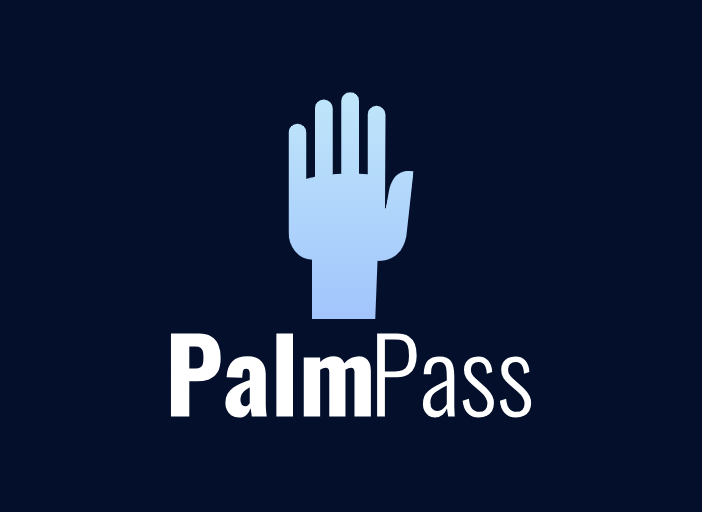

# PalmPass

Palmpass is a Python project that utilizes OpenCV, and Tkinter to create a secure and intuitive hand gesture recognition system. The project allows users to encrypt and access sensitive text files by raising a specific number of fingers, detected through hand tracing using OpenCV.

## Features

- Hand gesture recognition: Utilizes OpenCV to trace hand movements and accurately detect the number of fingers raised by the user.
- Encryption functionality: Enables users to encrypt and store sensitive text files, accessible only through successful hand gesture recognition.
- AI-generated logo: Utilizes AI technology to create a visually appealing and professional logo for the project.

## Screenshots



## Installation

1. Clone the repository:

```shell
git clone https://github.com/yourusername/palmpass.git
```
2. Install the required dependencies:

```
pip install -r requirements.txt
```

3. Run the application

```
python palmpass.py
```

4. Usage
-Enter your custom passlock(1-5)
-Enter text you wish to be locked
-Place hand in front of camera and raise desired number of fingers
-If finger count matched predefined passlock, encrypted text will be displayed on the screen using Tkinter

## Goals
Future goals of this project is to potentially have an actual program that encrypts your passlock and it can lock more than text, possibly files.

## Contributing
Contributions are very welcome! If you encounter any issues or have suggestions for improvements, please feel free to submit a pull request

## Acknowledgements
-Hand gesture recognition implementation was inspired by the work of CV Zone
